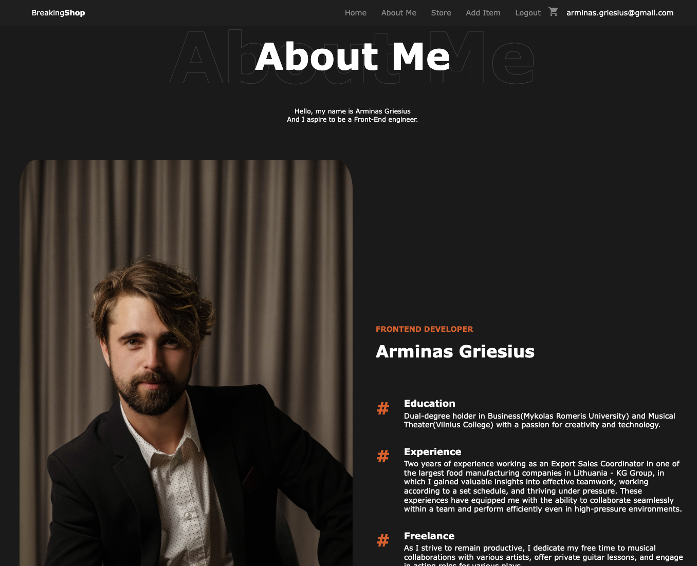

<h3 align="center">React Portfolio</h3>

<h3 align="center">Personal project for me to learn FrontEnd (React, module CSS, Firebase).</h3>

<h3 align="center">https://react-portfolio-ag.web.app/</h3>

## Table Of Contents

- [Table Of Contents](#table-of-contents)
- [About The Project](#about-the-project)
- [Showcase](#showcase)
- [Getting Started](#getting-started)
  - [Prerequisites](#prerequisites)
  - [Installation](#installation)
- [Authors](#authors)

## About the project

Welcome to my "React Portfolio" project! 🚀

This project serves as a dynamic showcase of my journey in learning frontend technologies. Through the use of React, module CSS, Firebase and various other technologies. I am exploring the vast landscape of web development, improving my skills with each line of code.

**Objective**:

With this project, my goal is not only to showcase my technical proficiency but also to present myself to recruiters and fellow developers. It's a living testament to my dedication to mastering frontend technologies and my enthusiasm for creating engaging web experiences.

## Showcase

`/`


`/store`


`/about`


`/passion-music`


## Getting Started

This is an example of how you may give instructions on setting up your project locally.
To get a local copy up and running follow these simple example steps.

### Prerequisites

Node.js v18+

```
https://nodejs.org/en/download
```

### Installation

1. Clone the repo

```
git clone https://github.com/ArminasGriesius/React-Portfolio.git
```

2. Install dependencies

```
npm install
```

3. Run the project

```
npm start
```

## Authors

- _Arminas Griesius_ - Front End developer wannabe - [Arminas Griesius](https://github.com/ArminasGriesius) - All Work
